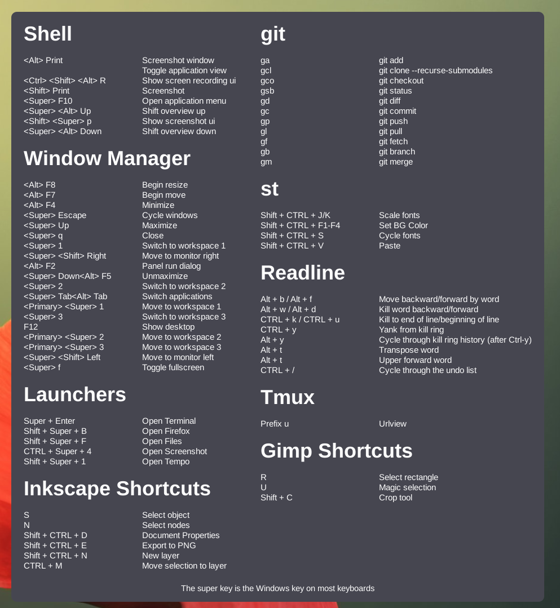

# Hotkeys Popup

Hotkeys Popup is a GNOME Shell Extension that displays currently configured
Gnome hotkeys in a popup.

## Features

- Show Gnome hotkeys found by introspection.
- Hide hotkeys you already your not interested in.
- Add your own extra hotkeys and hotkey groups.



## Usage

Open the preference to enable of disable automatically found hotkeys.

You can add extra shortcuts from a JSON File. Download the sample config file, and add you own groups and hotkeys.

```
curl https://raw.githubusercontent.com/mipmip/gnome-shell-extensions-hotkeys-popup/main/hotkeys-popup-custom-example.json > ~/.hotkeys-popup-custom.json
```

## Contributing

1. Fork it ( https://github.com/mipmip/gnome-shell-extensions-hotkeys-popup/fork )
1. Create your feature branch (git checkout -b my-new-feature)
1. Commit your changes (git commit -am 'Add some feature')
1. Push to the branch (git push origin my-new-feature)
1. Create a new Pull Request

## Credits

The idea of having an up to date hotkey popup window comes from AwesomeWM.

This extension is initially forked from [Shortcuts]
(https://gitlab.com/paddatrapper/shortcuts-gnome-extension).

### Install

You may need to restart GNOME (Alt + F2, r) before you see Shortcuts in your
list of extensions
